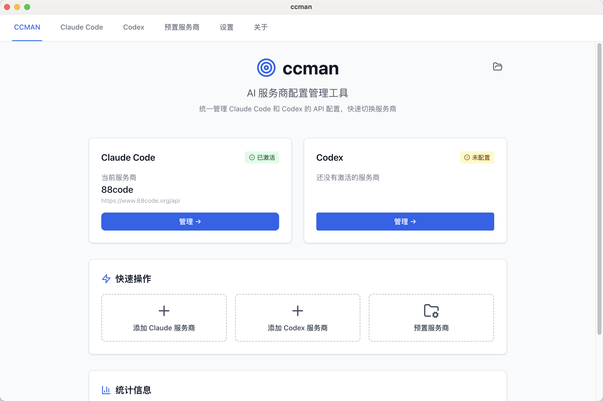
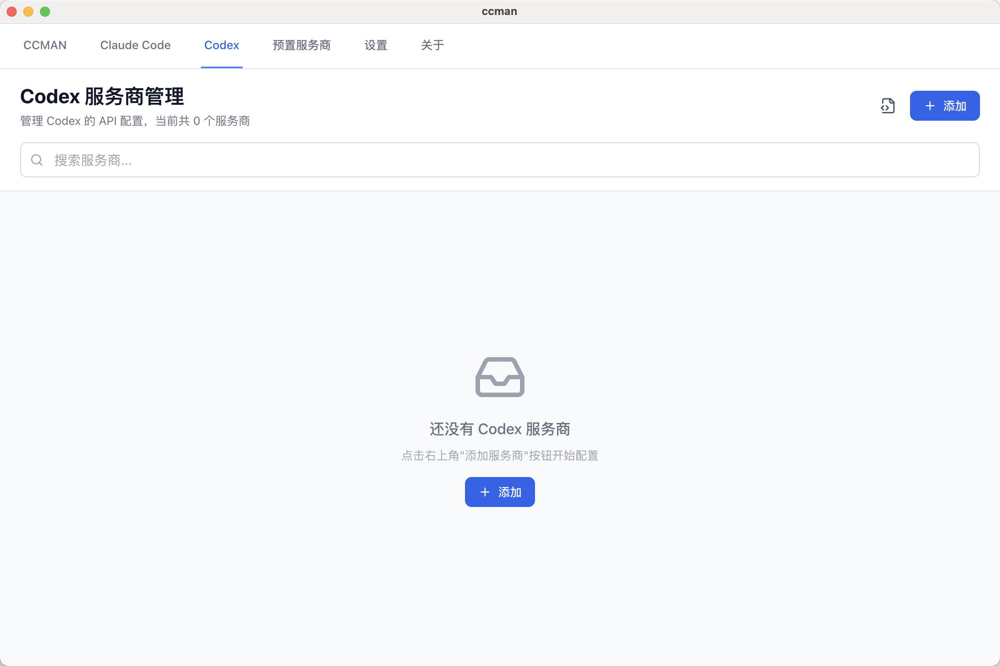
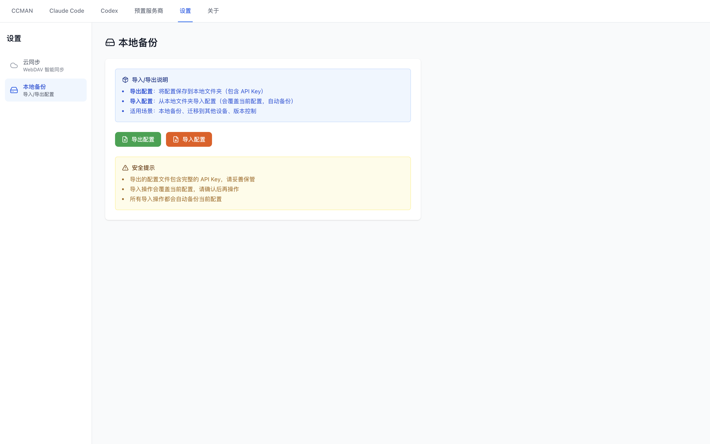
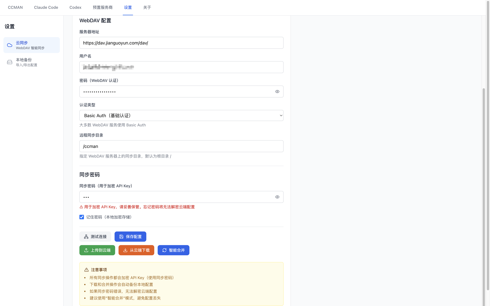

# ccman

一个用于 **Codex / Claude Code / Gemini CLI / OpenCode** 的 API 服务商配置管理工具，支持 CLI + Desktop，并提供 MCP 服务器管理与 WebDAV 同步。

## ✨ 功能概览

- **一键切换服务商**：Codex / Claude Code / Gemini CLI / OpenCode
- **内置预设模板**：提供常用模板（Desktop 支持自定义预设）
- **零破坏性写入**：合并用户现有配置，仅更新必要字段
- **MCP 管理**：集中管理 MCP 服务器（可在 Desktop 选择同步到 Claude/Gemini，Codex 暂不支持）
- **WebDAV 同步**：Codex / Claude / Gemini 配置备份、下载、合并
- **导入/导出**：仅支持 Codex / Claude 配置
- **Claude 历史清理**：分析并清理 `~/.claude.json`

## ✅ 支持的工具与配置路径

| 工具            | 主要配置文件                                                                | 说明                                                                                        |
| --------------- | --------------------------------------------------------------------------- | ------------------------------------------------------------------------------------------- |
| **Codex**       | `~/.codex/config.toml` + `~/.codex/auth.json`                               | `auth.json` 使用 `OPENAI_API_KEY`                                                           |
| **Claude Code** | `~/.claude/settings.json`                                                   | 另有历史文件 `~/.claude.json`                                                               |
| **Gemini CLI**  | `~/.gemini/settings.json` + `~/.gemini/.env`                                | `.env` 使用 `GOOGLE_GEMINI_BASE_URL` / `GEMINI_API_KEY` / `GOOGLE_API_KEY` / `GEMINI_MODEL` |
| **OpenCode**    | `~/.config/opencode/opencode.json`                                          | 写入 `provider` 配置与模型变体                                                              |
| **ccman**       | `~/.ccman/{codex,claude,gemini,opencode,mcp}.json` + `~/.ccman/config.json` | 保存服务商与 MCP 配置，WebDAV 同步配置存放在 `config.json`                                  |

## 📦 内置预设

### Claude Code

- **Anthropic Official**：`https://api.anthropic.com`
- **GMN**：`https://gmn.chuangzuoli.com/api`

### Codex

- **OpenAI Official**：`https://api.openai.com/v1`
- **GMN**：`https://gmn.chuangzuoli.com`

### Gemini CLI

- **Google Gemini (API Key)**：官方默认（无需设置 baseUrl）
- **GMN**：`https://gmn.chuangzuoli.com`

### OpenCode

- **GMN**：`https://gmn.chuangzuoli.com`（npm: `@ai-sdk/openai`）

## 🧭 CLI 使用速览

### 交互式入口

```bash
ccman
```

执行效果（主菜单）：

```bash
$ ccman

? 请选择操作:
  ❯ 🔷 Claude 管理
    🔶 Codex 管理
    💎 Gemini 管理
    🧩 OpenCode 管理
    🔄 WebDAV 同步
    📦 预置服务商管理
    ❌ 退出
```

### Codex / Claude / Gemini / OpenCode 服务商管理

```bash
ccman cx add|list|use|current|edit|remove|clone
ccman cc add|list|use|current|edit|remove|clone|clean:analyze|clean
ccman gm add|list|use|current|edit|remove|clone
ccman oc add|list|use|current|edit|remove|clone
```

交互式工具菜单（以 Codex 为例）：

```bash
$ ccman cx

? 🔶 Codex 操作:
  ❯ ➕ 添加服务商
    🔄 切换服务商
    📋 列出所有服务商
    👁️  查看当前服务商
    ✏️  编辑服务商
    🔁 克隆服务商
    🗑️  删除服务商
    ⬅️  返回上级
```

下面补充每个命令的执行效果示例（交互式流程与输出与源码一致）。

#### Codex 命令执行效果

**add**

```bash
$ ccman cx add

📝 添加 Codex 服务商

? 选择配置来源:
  ❯ 📦 使用预置服务商
    ✏️  自定义配置

? 选择预置服务商:
  OpenAI Official - OpenAI 官方 API
  GMN - GMN 服务 (OpenAI/Codex 兼容)

使用预设: GMN - GMN 服务 (OpenAI/Codex 兼容)

? 服务商名称: GMN
? 描述(可选):
? API 地址: https://gmn.chuangzuoli.com
? API 密钥: ********

✅ 添加成功

  GMN [Codex]
  https://gmn.chuangzuoli.com

? 是否立即切换到此服务商? (Y/n)
✅ 已切换到新服务商

配置已更新:
  - ~/.codex/config.toml
  - ~/.codex/auth.json
```

**list**

```bash
$ ccman cx list

📋 Codex 服务商 (2 个)

  ●  OpenAI Official [当前]
     https://api.openai.com/v1
     OpenAI 官方 API

  ○  GMN
     https://gmn.chuangzuoli.com
     GMN 服务 (OpenAI/Codex 兼容)
```

**use**

```bash
$ ccman cx use

? 选择要切换的服务商:
  OpenAI Official - https://api.openai.com/v1
  GMN - https://gmn.chuangzuoli.com

✅ 切换成功

  GMN [Codex]
  URL: https://gmn.chuangzuoli.com

配置已更新:
  - ~/.codex/config.toml
  - ~/.codex/auth.json
```

**current**

```bash
$ ccman cx current

📍 当前 Codex 服务商

  OpenAI Official
  ID: codex-1768916063885-openai1
  URL: https://api.openai.com/v1
  最后使用: 2026/1/20 21:34:24
```

**edit**

```bash
$ ccman cx edit

? 选择要编辑的服务商:
  OpenAI Official - https://api.openai.com/v1
  GMN - https://gmn.chuangzuoli.com

✏️  编辑服务商

提示: 留空则保持原值

? 服务商名称: GMN
? API 地址: https://gmn.chuangzuoli.com
? API 密钥 (留空保持不变): ********

✅ 编辑成功

  GMN [Codex]
  ID: codex-1768916065885-gmn001
  URL: https://gmn.chuangzuoli.com
```

**clone**

```bash
$ ccman cx clone

? 选择要克隆的服务商:
  OpenAI Official - https://api.openai.com/v1
  GMN - https://gmn.chuangzuoli.com

克隆自: OpenAI Official

? 服务商名称: OpenAI Official（副本）
? 描述(可选):
? API 地址: https://api.openai.com/v1
? API 密钥: ********

✅ 克隆成功

  OpenAI Official（副本） [Codex]
  ID: codex-1768916069999-copy01
  URL: https://api.openai.com/v1
```

**remove**

```bash
$ ccman cx remove

? 选择要删除的服务商:
  OpenAI Official - https://api.openai.com/v1
  GMN - https://gmn.chuangzuoli.com

? 确定删除 "GMN"? (y/N)

✅ 已删除: GMN
```

#### Claude Code 命令执行效果

**add**

```bash
$ ccman cc add

📝 添加 Claude Code 服务商

? 选择配置来源:
  ❯ 📦 使用预置服务商
    ✏️  自定义配置

? 选择预置服务商:
  Anthropic Official - Anthropic 官方 API

使用预设: Anthropic Official - Anthropic 官方 API

? 服务商名称: Anthropic Official
? 描述(可选):
? API 地址: https://api.anthropic.com
? API 密钥: ********

✅ 添加成功

  Anthropic Official [Claude Code]
  https://api.anthropic.com

? 是否立即切换到此服务商? (Y/n)
✅ 已切换到新服务商

配置已更新:
  - ~/.claude/settings.json
```

**list**

```bash
$ ccman cc list

📋 Claude Code 服务商 (1 个)

  ●  Anthropic Official [当前]
     https://api.anthropic.com
     Anthropic 官方 API
```

**use**

```bash
$ ccman cc use

? 选择要切换的服务商:
  Anthropic Official - https://api.anthropic.com

✅ 切换成功

  Anthropic Official [Claude Code]
  URL: https://api.anthropic.com

配置已更新:
  - ~/.claude/settings.json
```

**current**

```bash
$ ccman cc current

📍 当前 Claude Code 服务商

  Anthropic Official
  ID: claude-1768916065885-anth01
  URL: https://api.anthropic.com
  最后使用: 2026/1/20 21:34:26
```

**edit**

```bash
$ ccman cc edit

? 选择要编辑的服务商:
  Anthropic Official - https://api.anthropic.com

✏️  编辑服务商

提示: 留空则保持原值

? 服务商名称: Anthropic Official
? API 地址: https://api.anthropic.com
? API 密钥 (留空保持不变): ********

✅ 编辑成功

  Anthropic Official [Claude Code]
  ID: claude-1768916065885-anth01
  URL: https://api.anthropic.com
```

**clone**

```bash
$ ccman cc clone

? 选择要克隆的服务商:
  Anthropic Official - https://api.anthropic.com

克隆自: Anthropic Official

? 服务商名称: Anthropic Official（副本）
? 描述(可选):
? API 地址: https://api.anthropic.com
? API 密钥: ********

✅ 克隆成功

  Anthropic Official（副本） [Claude Code]
  ID: claude-1768916072222-copy01
  URL: https://api.anthropic.com
```

**remove**

```bash
$ ccman cc remove

? 选择要删除的服务商:
  Anthropic Official - https://api.anthropic.com

? 确定删除 "Anthropic Official"? (y/N)

✅ 已删除: Anthropic Official
```

#### Gemini CLI 命令执行效果

**add**

```bash
$ ccman gm add

📝 添加 Gemini CLI 服务商

? 选择配置来源:
  ❯ 📦 使用预置服务商
    ✏️  自定义配置

? 选择预置服务商:
  Google Gemini (API Key) - 使用官方 Gemini API（通过 GEMINI_API_KEY 或 GOOGLE_API_KEY 认证）
  GMN - GMN 服务 (Gemini 兼容)

使用预设: GMN - GMN 服务 (Gemini 兼容)

? 服务商名称: GMN
? 描述(可选):
? API 地址: https://gmn.chuangzuoli.com
? API 密钥: ********

✅ 添加成功

  GMN [Gemini CLI]
  https://gmn.chuangzuoli.com

? 是否立即切换到此服务商? (Y/n)
✅ 已切换到新服务商

配置已更新:
  - ~/.gemini/settings.json
  - ~/.gemini/.env
```

**list**

```bash
$ ccman gm list

📋 Gemini CLI 服务商 (2 个)

  ●  Google Gemini (API Key) [当前]

     官方 Gemini API

  ○  GMN
     https://gmn.chuangzuoli.com
     GMN 服务 (Gemini 兼容)
```

**use**

```bash
$ ccman gm use

? 选择要切换的服务商:
  Google Gemini (API Key) - (默认端点)
  GMN - https://gmn.chuangzuoli.com

✅ 切换成功

  GMN [Gemini CLI]
  URL: https://gmn.chuangzuoli.com

配置已更新:
  - ~/.gemini/settings.json
  - ~/.gemini/.env
```

**current**

```bash
$ ccman gm current

🎯 当前 Gemini CLI 服务商

  名称: Google Gemini (API Key)
  地址: (默认端点)
```

**edit**

```bash
$ ccman gm edit

? 选择要编辑的服务商:
  Google Gemini (API Key) - (默认端点)
  GMN - https://gmn.chuangzuoli.com

? 服务商名称: GMN
? 描述(可选):
? API 地址: https://gmn.chuangzuoli.com
? API 密钥: ********

✅ 编辑成功
```

**clone**

```bash
$ ccman gm clone

? 选择要克隆的服务商:
  Google Gemini (API Key) - (默认端点)
  GMN - https://gmn.chuangzuoli.com

? 输入新服务商名称:

✅ 克隆成功

  GMN（副本） [Gemini CLI]
  https://gmn.chuangzuoli.com
```

**remove**

```bash
$ ccman gm remove

? 选择要删除的服务商:
  Google Gemini (API Key) - (默认端点)
  GMN - https://gmn.chuangzuoli.com

? 确定要删除服务商 "GMN" 吗？ (y/N)

✅ 已删除服务商
```

#### OpenCode 命令执行效果

**add**

```bash
$ ccman oc add

📝 添加 OpenCode 服务商

? 选择配置来源:
  ❯ 📦 使用预置服务商
    ✏️  自定义配置

? 选择预置服务商:
  GMN - GMN 服务 (OpenCode 兼容)

使用预设: GMN - GMN 服务 (OpenCode 兼容)

? 服务商名称: GMN
? 描述(可选):
? API 地址: https://gmn.chuangzuoli.com
? API 密钥: ********
? 兼容包 (npm): @ai-sdk/openai

✅ 添加成功

  GMN [OpenCode]
  https://gmn.chuangzuoli.com

? 是否立即切换到此服务商? (Y/n)
✅ 已切换到新服务商

配置已更新:
  - ~/.config/opencode/opencode.json
```

**list**

```bash
$ ccman oc list

📋 OpenCode 服务商 (1 个)

  ●  GMN [当前]
     https://gmn.chuangzuoli.com
     GMN 服务 (OpenCode 兼容)
```

**use**

```bash
$ ccman oc use

? 选择要切换的服务商:
  GMN - https://gmn.chuangzuoli.com

✅ 切换成功

  GMN [OpenCode]
  URL: https://gmn.chuangzuoli.com

配置已更新:
  - ~/.config/opencode/opencode.json
```

**current**

```bash
$ ccman oc current

🎯 当前 OpenCode 服务商

  名称: GMN
  地址: https://gmn.chuangzuoli.com
```

**edit**

```bash
$ ccman oc edit

? 选择要编辑的服务商:
  GMN - https://gmn.chuangzuoli.com

? 服务商名称: GMN
? 描述(可选):
? API 地址: https://gmn.chuangzuoli.com
? API 密钥: ********
? 兼容包 (npm): @ai-sdk/openai

✅ 编辑成功
```

**clone**

```bash
$ ccman oc clone

? 选择要克隆的服务商:
  GMN - https://gmn.chuangzuoli.com

克隆自: GMN

? 服务商名称: GMN（副本）
? 描述(可选):
? API 地址: https://gmn.chuangzuoli.com
? API 密钥: ********
? 兼容包 (npm): @ai-sdk/openai

✅ 克隆成功

  GMN（副本） [OpenCode]
  ID: opencode-1768916088888-copy01
  URL: https://gmn.chuangzuoli.com
```

**remove**

```bash
$ ccman oc remove

? 选择要删除的服务商:
  GMN - https://gmn.chuangzuoli.com

? 确定删除 "GMN"? (y/N)

✅ 已删除: GMN
```

### MCP 管理

```bash
ccman mcp add|list|edit|remove
```

> MCP 会同步到 Claude / Gemini（Codex 暂不支持）。

执行效果示例：

**add**

```bash
$ ccman mcp add

📝 添加 MCP 服务器

? 选择配置来源:
  ❯ 📦 使用预置 MCP 服务器
    ✏️  自定义配置

? 选择预置 MCP 服务器:
  filesystem - 文件系统访问
  github - GitHub 集成
  postgres - PostgreSQL 数据库
  brave-search - Brave 搜索
  google-maps - Google Maps
  puppeteer - 浏览器自动化
  sqlite - SQLite 数据库
  sequential-thinking - 序列思考增强

使用预设: filesystem - 文件系统访问

⚠️  需要修改第3个参数为允许访问的目录路径

? MCP 服务器名称: filesystem
? 启动命令: npx
? 命令参数 (空格分隔): -y @modelcontextprotocol/server-filesystem /path/to/allowed/files
? 环境变量 (JSON 格式, 如 {"API_KEY": "xxx"}, 可留空):

✅ MCP 服务器添加成功

  filesystem [MCP]
  npx -y @modelcontextprotocol/server-filesystem /path/to/allowed/files

✅ 配置已自动同步到 ~/.claude/settings.json

配置文件:
  - ~/.claude/settings.json
```

**list**

```bash
$ ccman mcp list

📋 MCP 服务器 (2 个)

  ○ filesystem
    npx -y @modelcontextprotocol/server-filesystem /path/to/allowed/files

  ○ github
    npx -y @modelcontextprotocol/server-github
    环境变量: GITHUB_PERSONAL_ACCESS_TOKEN

提示: 所有配置的 MCP 服务器会自动同步到 ~/.claude/settings.json（可在 Desktop 选择同步到 Gemini CLI）
```

**edit**

```bash
$ ccman mcp edit

? 选择要编辑的 MCP 服务器:
  filesystem - npx -y @modelcontextprotocol/server-filesystem /path/to/allowed/files
  github - npx -y @modelcontextprotocol/server-github

✏️  编辑 MCP 服务器

提示: 留空则保持原值

? MCP 服务器名称: github
? 启动命令: npx
? 命令参数 (空格分隔, 留空保持不变): -y @modelcontextprotocol/server-github
? 环境变量 (JSON 格式, 留空保持不变): {"GITHUB_PERSONAL_ACCESS_TOKEN":"******"}

✅ 编辑成功

  github [MCP]
  命令: npx -y @modelcontextprotocol/server-github
  环境变量: GITHUB_PERSONAL_ACCESS_TOKEN

✅ 配置已自动同步到 ~/.claude/settings.json

配置文件:
  - ~/.claude/settings.json
```

**remove**

```bash
$ ccman mcp remove

? 选择要删除的 MCP 服务器:
  filesystem - npx -y @modelcontextprotocol/server-filesystem /path/to/allowed/files
  github - npx -y @modelcontextprotocol/server-github

? 确定删除 "github"? (y/N)

✅ 已删除: github

✅ 配置已自动同步到 ~/.claude/settings.json

配置文件:
  - ~/.claude/settings.json
```

### WebDAV 同步

```bash
ccman sync
ccman sync config
ccman sync test
ccman sync upload
ccman sync download
ccman sync merge
ccman sync status
```

> WebDAV 同步目前覆盖 Codex / Claude / Gemini 配置，OpenCode 与 MCP 暂不参与同步。

执行效果示例（WebDAV）：

**同步菜单**

```bash
$ ccman sync

? 🔄 同步操作:
  ❯ ⚙️  配置 WebDAV 连接
    🔍 测试连接
    📤 上传到云端
    📥 从云端下载
    🔄 智能合并
    📊 查看同步状态
    ⬅️  返回上一级
```

**config**

```bash
$ ccman sync config

⚙️  配置 WebDAV 同步

? WebDAV 服务器地址: https://dav.example.com
? 用户名: alice
? WebDAV 密码: ********
? 认证类型: Basic Auth（基础认证）
? 远程同步目录: /ccman
? 同步密码（用于加密 API Key）: ********
? 记住同步密码? (Y/n)

✅ 配置保存成功

配置文件: ~/.ccman/config.json

? 是否立即测试连接? (Y/n)

🔍 测试 WebDAV 连接...

✅ 连接成功

  URL: https://dav.example.com
  用户: alice
  远程目录: /ccman
  认证类型: Basic Auth
```

**test**

```bash
$ ccman sync test

🔍 测试 WebDAV 连接...

✅ 连接成功

  URL: https://dav.example.com
  用户: alice
  远程目录: /ccman
  认证类型: Basic Auth
```

**upload**

```bash
$ ccman sync upload

📤 上传配置到云端

配置信息:
  Codex 服务商: 2 个
  Claude 服务商: 1 个

⚠️  云端现有配置将被覆盖

? 确认上传? (y/N)

🔐 加密 API Key...
📤 上传到 WebDAV...

✅ 上传成功

远程文件:
  https://dav.example.com/ccman/.ccman/codex.json
  https://dav.example.com/ccman/.ccman/claude.json

💡 其他设备可通过 'ccman sync download' 获取配置
```

**download**

```bash
$ ccman sync download

📥 从云端下载配置

⚠️  将覆盖本地配置（自动备份）

? 确认下载? (y/N)

💾 备份本地配置...
📥 下载远程配置...
🔓 解密 API Key...

✅ 下载成功

本地备份:
  ~/.ccman/codex.json.backup.1768929300000
  ~/.ccman/claude.json.backup.1768929300000

💡 配置已更新，重新加载生效
```

**merge**

```bash
$ ccman sync merge

🔄 智能合并配置

分析本地和云端配置...

✅ 配置已智能合并并同步

备份:
  ~/.ccman/codex.json.backup.1768929480000
  ~/.ccman/claude.json.backup.1768929480000

合并规则:
  • 相同 ID：保留最新修改
  • 相同配置（URL+Key）：保留最新修改
  • 不同配置：全部保留，自动处理 name 冲突
```

**status**

```bash
$ ccman sync status

📊 同步状态

WebDAV 配置:
  URL: https://dav.example.com
  用户: alice
  远程目录: /ccman
  认证: Basic Auth
  同步密码: ✓ 已保存

本地配置:
  Codex: 2 个服务商
  Claude: 1 个服务商
  最后同步: 2026/1/20 21:38:12

同步建议:
  💡 上传到云端: ccman sync upload
  💡 从云端下载: ccman sync download
  💡 智能合并: ccman sync merge
```

### 导入 / 导出

```bash
ccman export [dir]
ccman import [dir]
```

执行效果示例（导入 / 导出）：

**export**

```bash
$ ccman export ~/backup/ccman

📦 导出配置

导出文件:
  codex.json  - Codex 配置
  claude.json - Claude 配置

目标目录: /Users/you/backup/ccman

⚠️  导出文件包含 API Key，请妥善保管

✅ 导出成功

已导出文件:
  ✓ codex.json
  ✓ claude.json

💡 导入命令: ccman import /Users/you/backup/ccman
```

**import**

```bash
$ ccman import ~/backup/ccman

📥 导入配置

⚠️  警告：导入将覆盖当前配置

源目录: /Users/you/backup/ccman

找到配置文件:
  ✓ codex.json
  ✓ claude.json

当前配置将被覆盖（自动备份）

? 确认导入？ (y/N)

⚠️  最后确认：此操作将覆盖所有当前配置！

? 真的要继续吗？ (y/N)

💾 备份当前配置...
📥 导入新配置...

✅ 导入成功

备份文件:
  /Users/you/.ccman/codex.json.backup.1768929720000
  /Users/you/.ccman/claude.json.backup.1768929720000

已导入文件:
  ✓ codex.json
  ✓ claude.json

💡 请使用 'ccman cx use' 或 'ccman cc use' 切换服务商
```

### Claude 历史清理

```bash
ccman cc clean:analyze
ccman cc clean
```

执行效果示例（历史清理）：

**clean:analyze**

```bash
$ ccman cc clean:analyze

📊 分析 ~/.claude.json

文件大小: 18.6 MB

项目统计:
  项目总数: 24
  历史记录总数: 862 条

历史记录最多的项目:
   96 条  .../work/projects/alpha
   88 条  .../work/projects/bravo
   77 条  .../work/projects/charlie
   65 条  .../work/projects/delta
   59 条  .../work/projects/echo

预计可节省空间:
  保守清理 (保留10条): 6.2 MB
  中等清理 (保留5条):  9.7 MB
  激进清理 (清空历史):  14.8 MB

💡 执行清理: ccman cc clean
```

**clean**

```bash
$ ccman cc clean

🧹 清理 ~/.claude.json

当前文件大小: 18.6 MB
项目数: 24, 历史记录: 862 条

? 选择清理方案:
  ❯ 保守清理 - 保留最近10条记录，清理缓存 (节省约 6.2 MB)
    中等清理 - 保留最近5条记录，清理缓存和统计 (节省约 9.7 MB)
    激进清理 - 清空历史记录，清理缓存和统计 (节省约 14.8 MB)
    自定义 - 自定义清理选项

? 确认执行清理？（会自动备份原文件） (Y/n)

正在清理...

✅ 清理完成

清理前: 18.6 MB
清理后: 9.9 MB
节省空间: 8.7 MB (46.8%)

清理历史记录: 840 条
清理缓存: ✓

备份文件: /Users/you/.claude.json.backup-2026-01-20T21-45-00
```

## 📸 界面截图

**主界面**


**预置服务商**


**Codex 配置**


**Claude Code 配置**


**导入导出**


**WebDAV 同步**


## 🧱 目录结构

```
packages/
  core/      # 核心逻辑（读写配置、预设、同步）
  cli/       # CLI 工具
  desktop/   # Desktop GUI (Electron)
  types/     # 共享类型定义
```

## 🛡️ 写入策略说明

- **Claude/Codex/Gemini 配置写入**采用深度合并策略：
  - 保留用户已有字段与自定义设置
  - 仅覆盖与认证相关的必要字段
- **Codex** 会写入 `config.toml` 与 `auth.json`（只更新 `OPENAI_API_KEY`）
- **Gemini** 会写入 `settings.json` 与 `.env`
- **OpenCode** 会写入 `~/.config/opencode/opencode.json`

## 🛠️ 开发与构建

```bash
pnpm install

# 启动 CLI（开发模式）
pnpm --filter ccman dev

# 启动 Desktop（可选）
pnpm --filter @ccman/desktop dev
```

构建全部包：

```bash
pnpm build
```

## 📄 License

MIT
