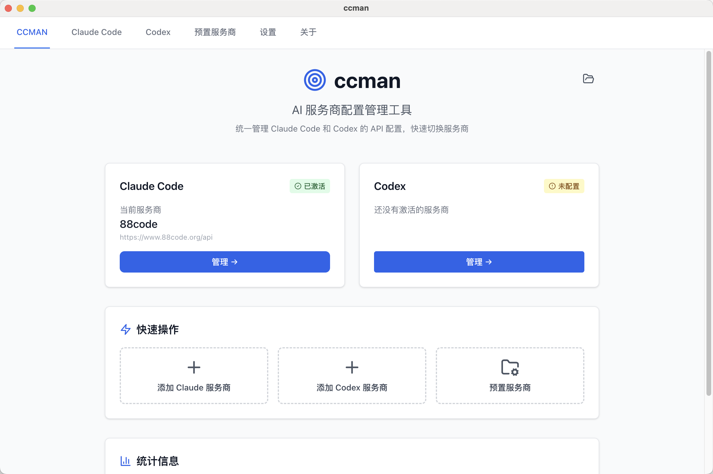
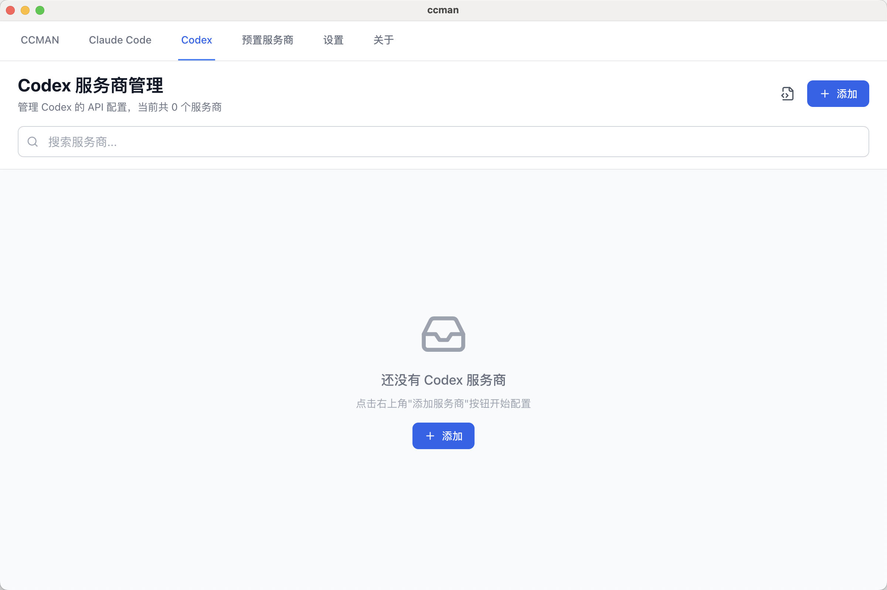
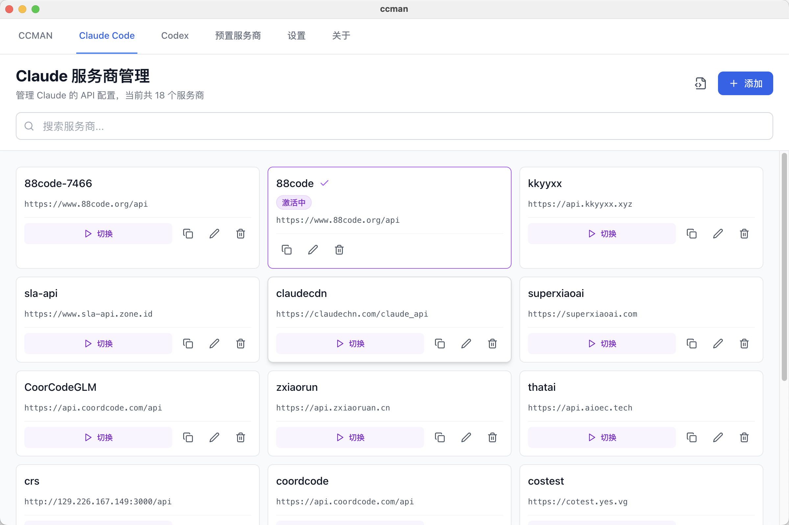
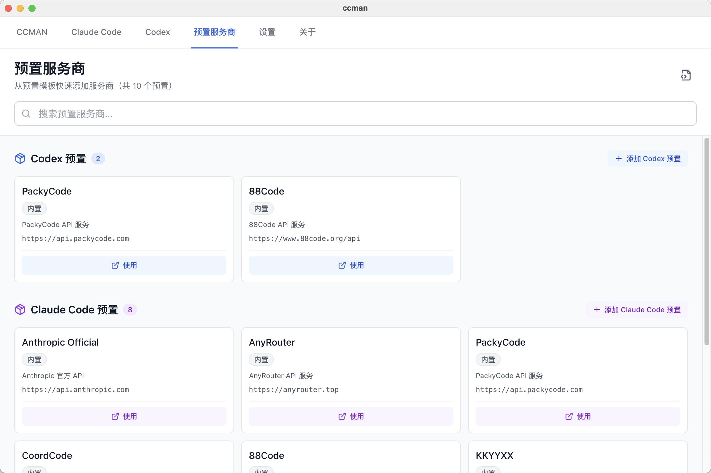
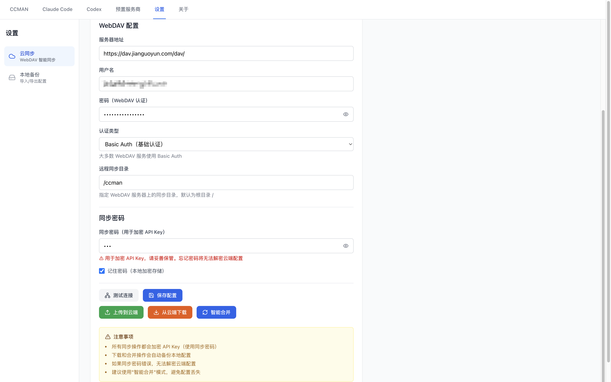
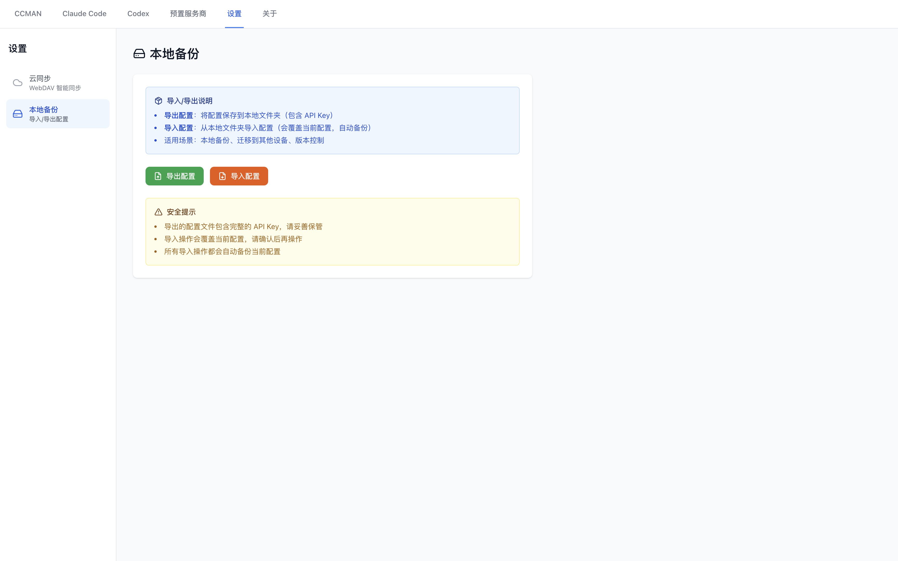

# ccman 界面截图

本页面展示 ccman Desktop 版本的所有功能界面。

---

## 主界面

  
  
<em>主界面 - 服务商管理和切换</em>

ccman 的主界面提供直观的服务商管理功能，支持：
- 查看所有已配置的服务商
- 一键切换当前使用的服务商
- 快速添加、编辑、删除服务商
- 显示当前激活的服务商状态

---

## Codex 配置页面

  
  
<em>Codex 服务商配置管理</em>

Codex 配置页面专门管理 Codex 相关的服务商配置，支持：
- 添加和管理多个 Codex 服务商
- 使用预设模板快速配置
- 查看和编辑服务商详细信息
- 克隆服务商配置

---

## Claude Code 配置页面

  
  
<em>Claude Code 服务商配置管理</em>

Claude Code 配置页面提供 Claude Code 专用的配置管理，支持：
- 管理多个 Claude Code API 服务商
- 快速切换不同的 API 配置
- 预置服务商模板
- 自定义服务商配置

---

## 预置服务商

  
  
<em>内置的服务商预设模板</em>

ccman 内置了官方与 GMN 的服务商预设，包括：
- Anthropic Official
- OpenAI Official
- Google Gemini (API Key)
- GMN

使用预设模板，只需填写 API Key 即可快速添加服务商。

---

## 设置页面 - WebDAV 同步

  
  
<em>WebDAV 云同步功能配置</em>

WebDAV 同步功能支持：
- 配置 WebDAV 服务器连接
- 支持 iCloud、Dropbox、坚果云等主流 WebDAV 服务
- 智能合并本地和云端配置
- API Key 加密传输
- 自动备份本地配置

---

## 设置页面 - 导入导出

  
  
<em>配置导入导出功能</em>

导入导出功能支持：
- 导出配置到本地文件夹
- 从本地文件夹导入配置
- 自动备份当前配置
- 支持跨设备配置迁移

---

## 返回

👉 [返回主 README](../README.md)
