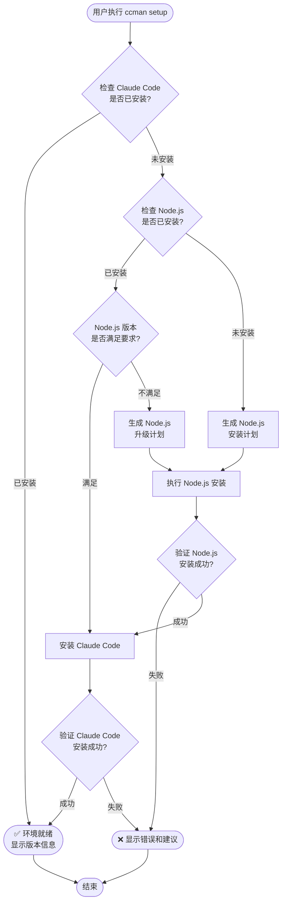
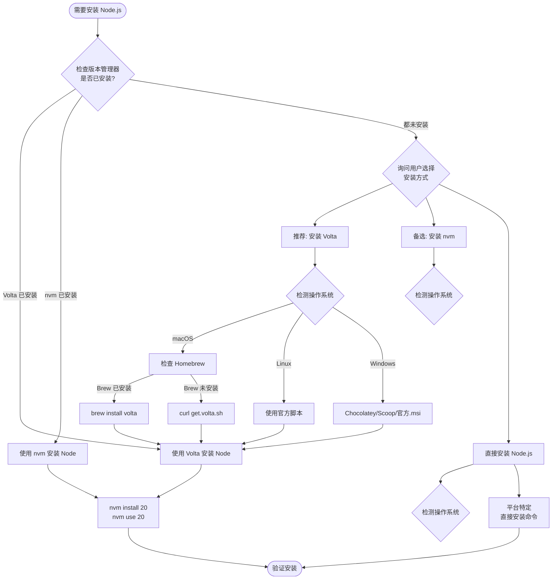
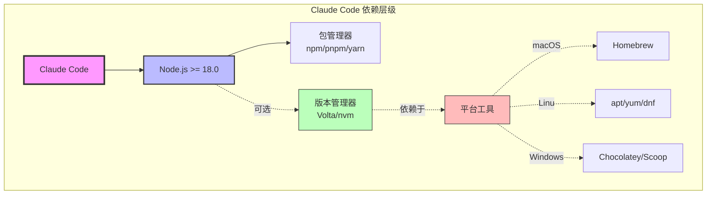
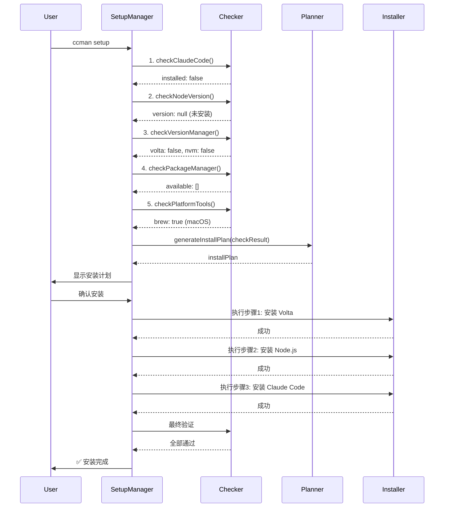
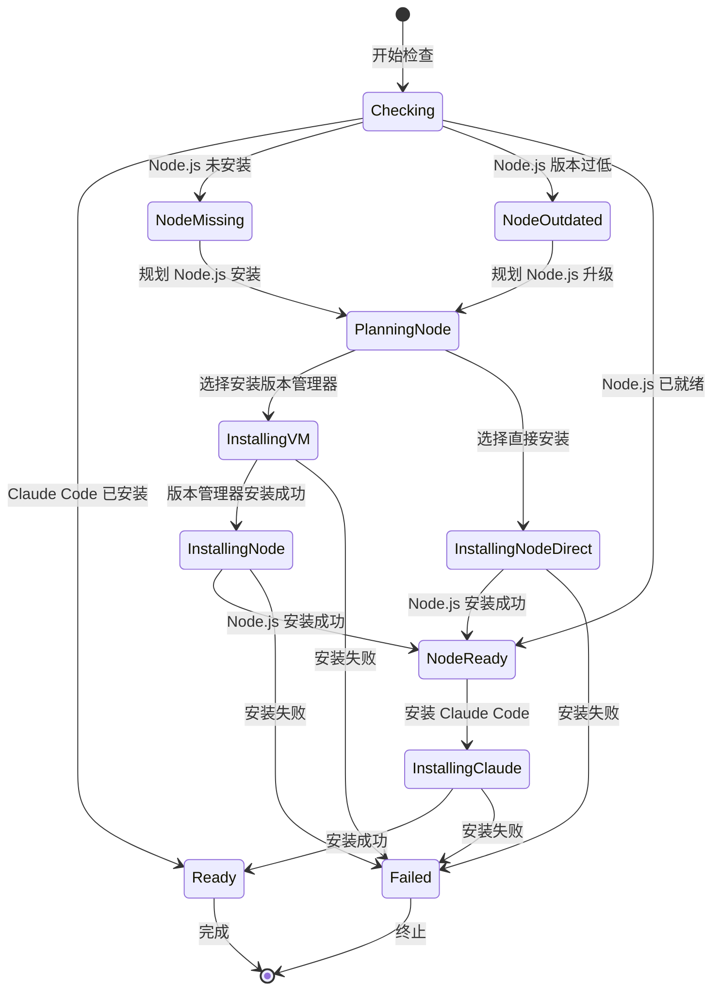
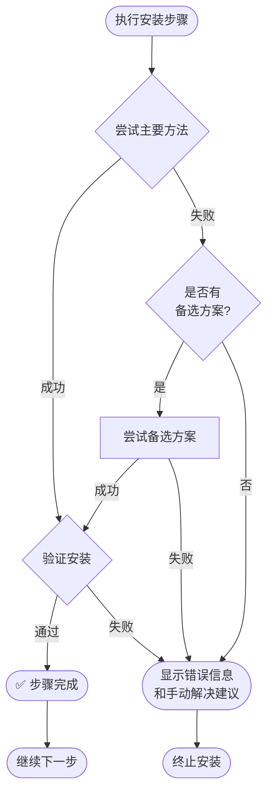

# CCM 环境检查和安装逻辑流程

## 1. 主流程图



## 2. Node.js 安装决策树



## 3. 依赖关系图



## 4. 检查顺序流程



## 5. 并行检查 vs 串行执行

### 并行检查阶段（可同时进行）
```typescript
// 这些检查互不依赖，可以并行执行
const [
  claudeCodeInstalled,
  nodeInfo,
  vmInfo,
  pmInfo,
  platformInfo
] = await Promise.all([
  checkClaudeCode(),      // 检查1
  checkNodeVersion(),     // 检查2
  checkVersionManager(),  // 检查3
  checkPackageManager(),  // 检查4
  checkPlatformTools()    // 检查5
]);
```

### 串行执行阶段（必须按顺序）
```typescript
// 安装必须按依赖顺序执行
// Step 1: 安装版本管理器（如果需要）
if (needVersionManager) {
  await installVersionManager(); // Volta 或 nvm
  // ⚠️ 必须等待完成才能继续
}

// Step 2: 安装 Node.js（依赖于 Step 1）
await installNode();
// ⚠️ 必须等待完成才能继续

// Step 3: 安装 Claude Code（依赖于 Step 2）
await installClaudeCode();
```

## 6. 前置条件判断矩阵

| 安装目标 | 前置条件 | 可选优化 | 平台工具依赖 |
|---------|---------|---------|------------|
| **Volta** | 无 | Homebrew (macOS) | brew/choco/scoop |
| **nvm** | 无 | Homebrew (macOS) | brew (可选) |
| **Node.js (via Volta)** | ✅ Volta | - | - |
| **Node.js (via nvm)** | ✅ nvm | - | - |
| **Node.js (直接)** | 无 | Homebrew/apt/choco | brew/apt/yum/choco |
| **Claude Code** | ✅ Node.js >= 18<br/>✅ npm/pnpm/yarn | - | - |

## 7. 决策逻辑伪代码

```typescript
async function setupEnvironment() {
  // === 阶段1: 并行检查（无依赖关系） ===
  const envCheck = await parallelCheck();

  // 早期退出条件
  if (envCheck.claudeCodeInstalled) {
    return success('Claude Code 已安装');
  }

  // === 阶段2: 生成安装计划（基于检查结果） ===
  const plan = {
    steps: []
  };

  // 决策1: 是否需要安装 Node.js？
  if (!envCheck.nodeInstalled || !envCheck.nodeVersionValid) {

    // 决策2: 选择 Node.js 安装方式
    if (envCheck.voltaInstalled) {
      plan.steps.push({ action: 'installNodeViaVolta' });
    }
    else if (envCheck.nvmInstalled) {
      plan.steps.push({ action: 'installNodeViaNvm' });
    }
    else {
      // 决策3: 推荐安装版本管理器
      const choice = await askUser([
        { name: '推荐: 安装 Volta + Node.js', value: 'volta' },
        { name: '备选: 安装 nvm + Node.js', value: 'nvm' },
        { name: '直接安装 Node.js', value: 'direct' }
      ]);

      if (choice === 'volta') {
        // 决策4: 选择 Volta 安装方式（平台相关）
        if (envCheck.platform === 'darwin' && envCheck.brewInstalled) {
          plan.steps.push({ action: 'installVoltaViaBrew' });
        } else {
          plan.steps.push({ action: 'installVoltaViaScript' });
        }
        plan.steps.push({ action: 'installNodeViaVolta' });
      }
      else if (choice === 'nvm') {
        plan.steps.push({ action: 'installNvm' });
        plan.steps.push({ action: 'installNodeViaNvm' });
      }
      else {
        plan.steps.push({ action: 'installNodeDirect' });
      }
    }
  }

  // 最后一步: 安装 Claude Code（依赖 Node.js）
  plan.steps.push({ action: 'installClaudeCode' });

  // === 阶段3: 串行执行安装计划 ===
  for (const step of plan.steps) {
    const result = await executeStep(step);

    if (!result.success) {
      // 失败处理: 尝试备选方案或退出
      if (step.alternatives) {
        await tryAlternatives(step.alternatives);
      } else {
        return error('安装失败', step);
      }
    }
  }

  // === 阶段4: 最终验证 ===
  const finalCheck = await verifyInstallation();
  return finalCheck.success ? success() : error();
}
```

## 8. 关键依赖关系

```
前置依赖（必须先满足）:
├─ Claude Code
│  └─ 必须: Node.js >= 18.0
│     └─ 必须: npm/pnpm/yarn (通常随 Node 自动安装)
│
├─ Node.js (via Volta)
│  └─ 必须: Volta
│     └─ 可选: Homebrew (macOS, 简化安装)
│
├─ Node.js (via nvm)
│  └─ 必须: nvm
│     └─ 可选: Homebrew (macOS, 简化安装)
│
└─ Node.js (直接安装)
   └─ 可选: Homebrew/apt/yum/choco (简化安装)

优化依赖（非必需，但推荐）:
├─ macOS
│  └─ Homebrew → 简化所有软件安装
├─ Linux
│  └─ apt/yum/dnf → 系统包管理器
└─ Windows
   └─ Chocolatey/Scoop → 简化软件安装
```

## 9. 状态转换图



## 10. 错误处理和回退

